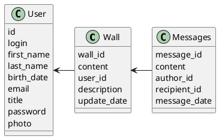

# Компонентная архитектура
<!-- Состав и взаимосвязи компонентов системы между собой и внешними системами с указанием протоколов, ключевые технологии, используемые для реализации компонентов.
Диаграмма контейнеров C4 и текстовое описание. 
-->
## Компонентная диаграмма

```plantuml
@startuml
!include https://raw.githubusercontent.com/plantuml-stdlib/C4-PlantUML/master/C4_Container.puml

AddElementTag("microService", $shape=EightSidedShape(), $bgColor="CornflowerBlue", $fontColor="white", $legendText="microservice")
AddElementTag("storage", $shape=RoundedBoxShape(), $bgColor="lightSkyBlue", $fontColor="white")

Person(admin, "Администратор")
Person(moderator, "Модератор")
Person(user, "Пользователь")

System_Ext(web_site, "Сайт социальной сети", "HTML, CSS, JavaScript, React", "Веб-интерфейс")

System_Boundary(conference_site, "Сайт социальной сети") {
   'Container(web_site, "Клиентский веб-сайт", ")
   Container(client_service, "Сервис регистрации и авторизации", "C++", "Сервис управления пользователями", $tags = "microService")    
   Container(post_service, "Сервис стены (личного кабинета пользователя)", "C++", "Сервис стены", $tags = "microService") 
   Container(blog_service, "Сервис отправки и получения сообщений", "C++", "Сервис сообщений", $tags = "microService")   
   Container(search_service, "Сервис поиска пользователей и подписки", "C++", "Сервис поиска", $tags = "microService") 
   ContainerDb(db, "База данных", "MySQL", "Хранение данных о постах, пользователях и сообщениях", $tags = "storage")
   
}

Rel(admin, web_site, "Просмотр, добавление и редактирование информации о пользователях, конференциях и докладах")
Rel(moderator, web_site, "Модерация контента и пользователей")
Rel(user, web_site, "Регистрация и авторизация пользователей. Создание и обновление стены пользователя. Отправка и получение сообщений. Поиск пользователей и подписка на их обновления.")

Rel(web_site, client_service, "Работа с пользователями", "localhost/person")
Rel(client_service, db, "INSERT/SELECT/UPDATE", "SQL")

Rel(web_site, post_service, "Работа со стеной", "localhost/pres")
Rel(post_service, db, "INSERT/SELECT/UPDATE", "SQL")

Rel(web_site, blog_service, "Работа с сообщениями", "localhost/conf")
Rel(blog_service, db, "INSERT/SELECT/UPDATE", "SQL")

Rel(web_site, search_service, "Работа с поиском и подписками", "localhost/conf")
Rel(search_service, db, "INSERT/SELECT/UPDATE", "SQL")


@enduml
```
## Список компонентов  

### Сервис регистрации и авторизации пользователей
**API**:
-	Регистрация пользователя
      - входные параметры: login, пароль, имя, фамилия, email, обращение (г-н/г-жа)
      - выходные параметры: подтверждение регистрации и сгенерированный пароль
-	Поиск пользователя по логину
     - входные параметры:  login
     - выходные параметры: имя, фамилия, email, обращение (г-н/г-жа)

### Сервис создания и обновления стены пользователя
**API**:
-	Поиск пользователя по маске имени и фамилии
     - входные параметры: маска фамилии, маска имени
     - выходные параметры: login, имя, фамилия, email, обращение (г-н/г-жа)
- Авторизация пользователя
     - входные параметры: адрес электронной почты и пароль
     - выходные параметры: информация о пользователе и доступ к его данным

### Сервис отправки и получения сообщений
**API**:
- Отправка сообщения
  - Входные параметры: содержание, получатель, дата, время
  - Выходные параметры: статус сообщения (отправлено/не отправлено)
- Получение сообщения
  - Входные параметры: содержание сообщения, отправитель, дата, время
  - Выходные параметры: уведомление о прочтении сообщения


### Сервис поиска пользователей и подписки на их обновления
**API**:
- Поиск пользователей
  - Входные параметры: критерии поиска (имя, фамилия, адрес электронной почты…)
  - Выходные параметры: список найденных пользователей
- Подписка на обновления пользователей
  - Входные параметры: пользователь, тип подписки (все обновления, обновления стены, личные сообщения…)
  - Выходные параметры: подтверждение подписки


### Модель данных
